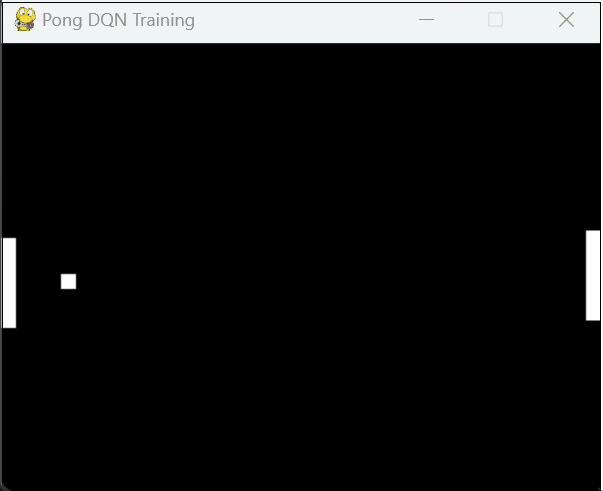
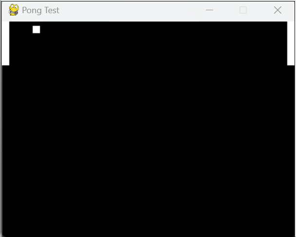
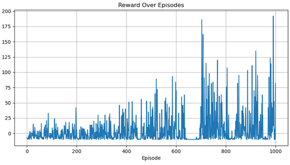
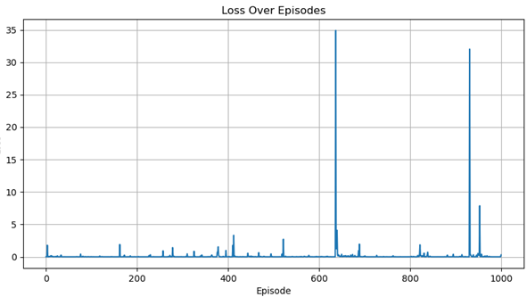
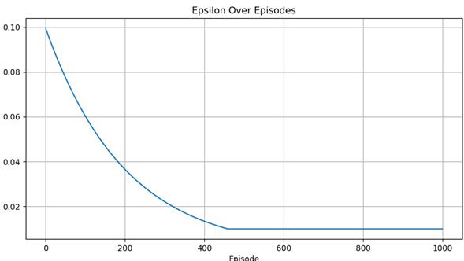

# Pong-DQN 强化学习项目

本项目实现了一个基于 Deep Q-Network（DQN）的强化学习智能体，使用 PyTorch 与 Pygame，从零训练智能体玩 Pong 游戏。项目以图像帧为输入，结合卷积神经网络进行特征提取，支持模型保存、训练日志记录及测试评估功能。

---


---
## 项目结构

```

pong\_dqn\_project/
├── pong\_env.py              # Pong 游戏环境（基于 Pygame）
├── deep\_q\_network.py       # DQN 网络模型结构
├── train.py                  # 模型训练主程序
├── test.py                   # 测试并评估训练好的模型
├── models/                   # 保存模型权重（自动创建）
├── runs/                     # 训练日志和 TensorBoard 曲线
└── README.md                 # 项目说明文档
````

---

## 环境配置（推荐使用 Anaconda）

### 1. 创建并激活环境

```bash
conda create -n pong-dqn python=3.12 -y
conda activate pong-dqn
````

### 2. 安装依赖

```bash
pip install torch torchvision
pip install pygame numpy opencv-python tensorboard
```

---

## 运行说明

### 1.训练模型

```bash
python train.py
```



训练过程会自动创建 `models/` 目录并保存模型为 `models/dqn_model.pth`.
训练日志记录在 `runs/` 中，供 TensorBoard 使用。
#### 注意调整参数配置，切换是第 1-1000 轮训练还是第 1001-2000 轮训练

### 2.测试模型

```bash
python test.py
```



默认使用 `models/pong_model_final.pth` 加载训练好的模型并在 Pong 环境中评估
#### 可以切换不同的模型权重，测试不同模型的表现


## 模型与算法概览

* **输入**：连续 4 帧灰度图像（处理后大小为 84×84）
* **网络结构**：三层卷积 + 两层全连接（参考 DeepMind DQN）
* **策略**：ε-greedy 策略进行动作选择，支持 ε 线性衰减
* **优化器**：Adam
* **损失函数**：均方误差损失 (MSE Loss)
* **经验回放**：Replay Buffer
* **目标网络**：周期性复制策略网络参数，提高训练稳定性

---

## 算法流程简要

1. 初始化 Replay Buffer、Q 网络与目标网络
2. 重复执行以下步骤直到终止：

   * 以 ε-greedy 策略选择动作
   * 执行动作，获得奖励和新状态
   * 存储转换到 Replay Buffer
   * 从 Buffer 中采样一批转换
   * 计算 TD 目标，更新网络参数
   * 每隔 C 步复制目标网络参数

---

## 🧾 模型参数说明（train.py 中）

| 参数                | 描述          | 默认值    |
| ----------------- | ----------- | ------ |
| `gamma`           | 折扣因子        | 0.99   |
| `epsilon_start`   | 探索起始概率      | 1.0    |
| `epsilon_end`     | 最小探索概率      | 0.1    |
| `epsilon_decay`   | 探索概率衰减系数    | 50000  |
| `learning_rate`   | 学习率         | 1e-4   |
| `batch_size`      | 训练批大小       | 32     |
| `memory_capacity` | 经验回放池大小     | 100000 |
| `target_update`   | 目标网络更新频率（步） | 1000   |
| `max_frames`      | 最大训练帧数      | 500000 |

---

## 训练结果

> 在2000轮训练后，奖励曲线（reward）、损失变化（loss）、变化探索率（epsilon）：


* 奖励曲线波动显著减小，整体稳定上升，智能体策略更加成熟。

* 损失变化维持低水平小幅波动，模型误差进一步收敛。

* 变化探索率已接近最小值（0.01），几乎完全采用确定性策略.

> 使用 test.py 脚本，加载训练完成的模型 pong_model_final.pth ：


> 模型成功完成测试！ 策略具有实战能力，能够有效完成 Pong 游戏目标。
---

## 常见问题（FAQ）

### Q1: 训练时窗口黑屏或卡死怎么办？

**A**：Pygame 在某些系统中窗口渲染可能卡住，可尝试：

* 不显示图像窗口，直接训练；
* 降低帧率；
* 升级显卡驱动或使用 CPU 模式训练。

### Q3: 如何加速训练过程？

**A**：

* 增加 batch size（如 64）；
* 降低图像分辨率；
* 使用 GPU 加速（确保安装 CUDA 版 PyTorch）；
* 保存训练中间模型，断点续训。

---
